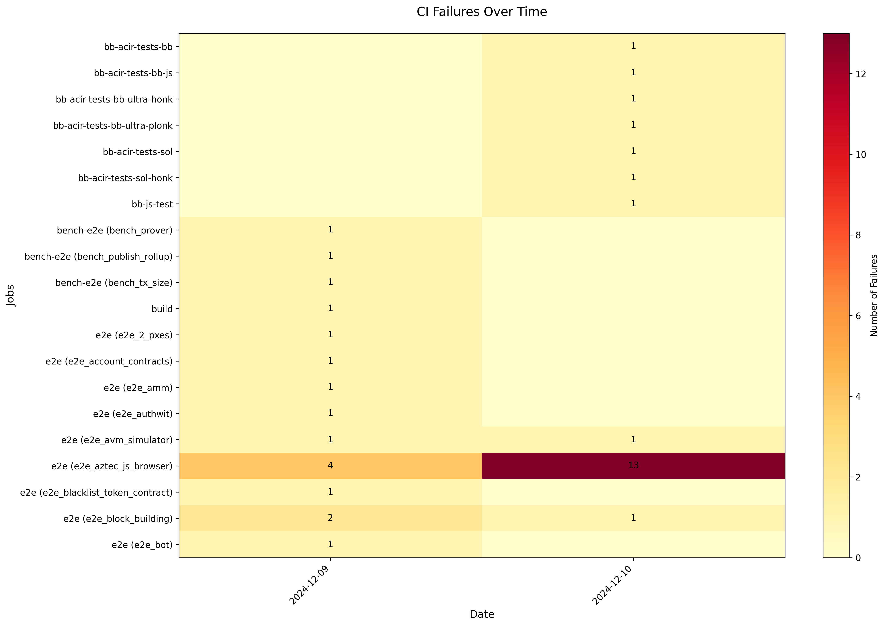

# Find Failing Tests

A Python tool to analyze and visualize GitHub Actions workflow failures over time. This tool helps identify patterns in CI failures by creating a heatmap visualization and providing detailed failure information.



## Installation

1. Clone the repository
2. `uv sync`
3. set the environment variables in `.env`

```
GITHUB_TOKEN=ghp_XXX
OWNER=aztecprotocol
REPO=aztec-packages
WORKFLOW_ID=ci.yml
BRANCH=master
```

4. `uv run main.py`
